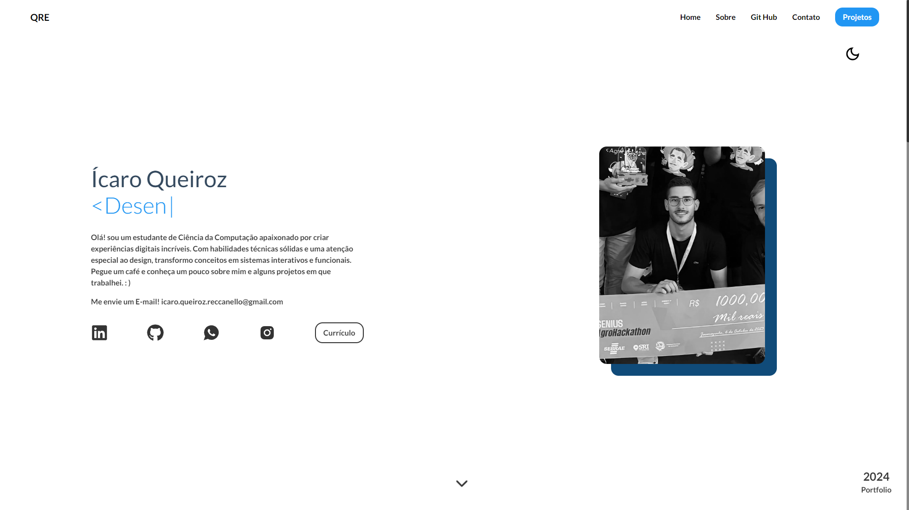
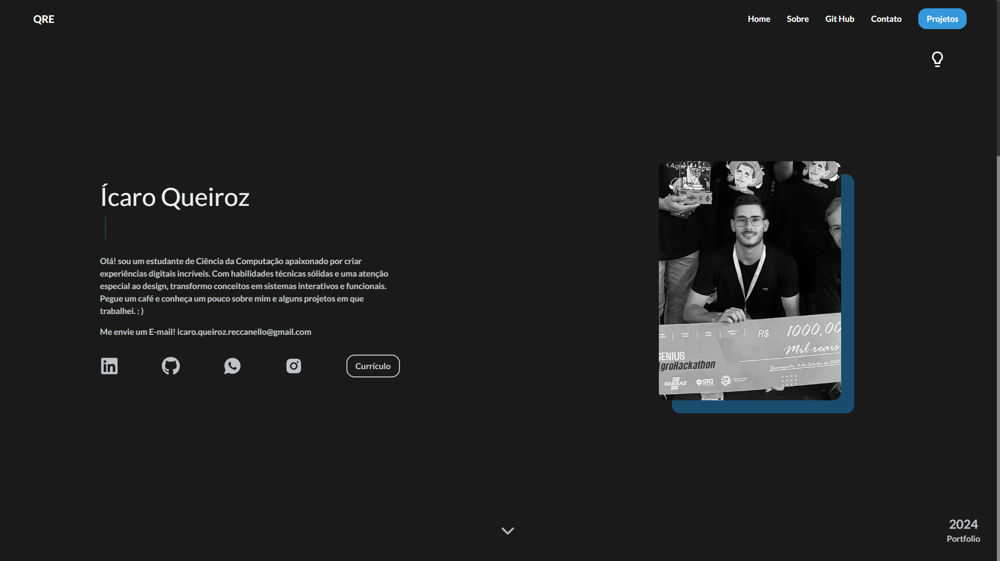
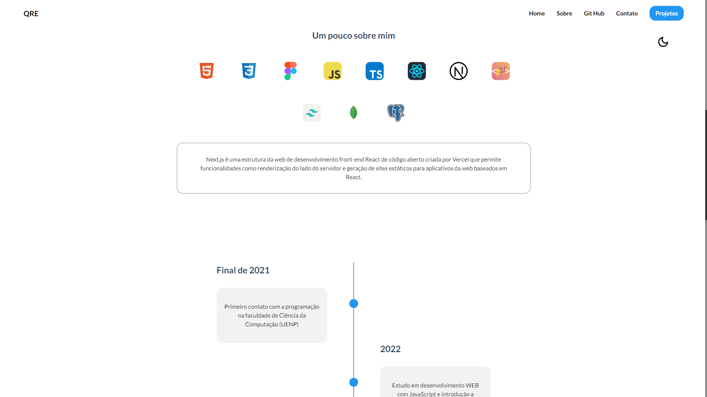
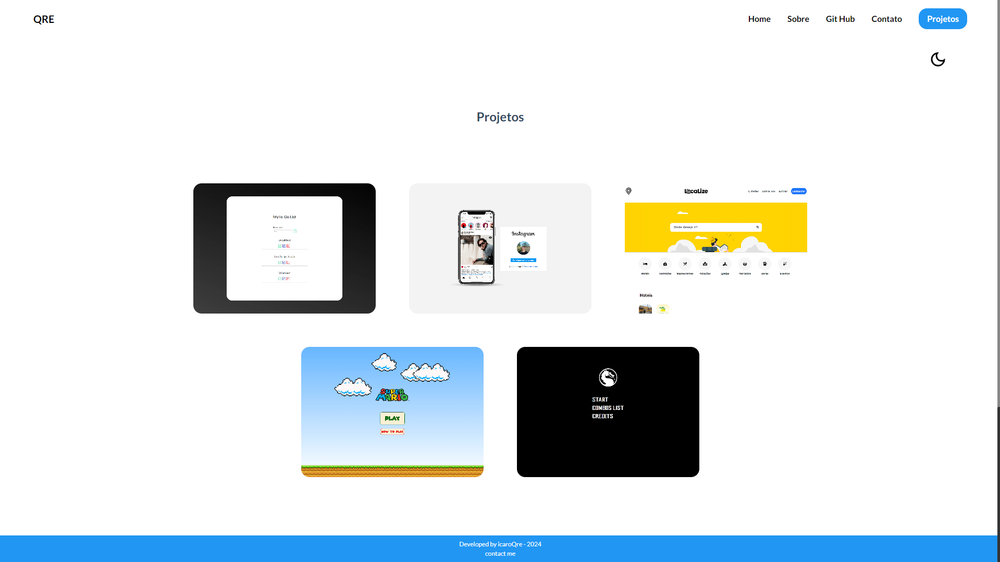

# Concheça meu Web Portfolio :computer:

## Sobre 📘

[Acesse meu Portfolio pessoal qui](https://my-portfolio-gilt-seven-12.vercel.app/), desenvolvido com o objetivo de estudo WEB e demonstração de uma parte de meus conhecimentos e projetos, a aplicação é totalmente responsiva para diversos tipos de layout, conta com a funçãod e mudança de tema Light☀️/Dark🌑 Mode, funções e componentes interativos e todos os contatos e informações pessoais necessárias sobre mim. Contato com 3 sessões principais:

1. Hero Section 
2. Sobre
   - Tecnologias
   - Time Line
3. Meus Projetos

## Hero Section 🦸

A Hero Section é a primeira coisa que os visitantes veem ao acessar meu portfólio. Nesta seção, há uma breve introdução com meu nome e um pequeno texto sobre mim e meu objetivo. Ela também inclui uma imagem interativa minha na versão Desktop, além de botões para redes sociais para entrar em contato comigo e um link para meu currículo.

## Sobre ☕

Na seção Sobre, apresento uma descrição mais detalhada sobre as tecnologias em que já trabalhei, possuindo uma caixa de texto interativa que apresenta ao usuário uma pequena descrição sobre a tecnologia quando seu ícone é selecionado, após isso, é apresentado uma pequena time line sobre minha trajetória desde meu primeiro contato com programação. Aqui, os visitantes podem aprender sobre minha trajetória profissional, minhas habilidades, interesses e quaisquer outras informações relevantes que me definem como profissional.

## Projetos ⚙️

A seção Projetos destaca alguns dos trabalhos que já realizei. Para cada projeto, forneço uma breve descrição, as tecnologias utilizadas, e, quando aplicável, links para o código-fonte no GitHub ou para uma demonstração ao vivo. Esta visa demonstrar minhas competências técnicas e minha capacidade de aplicar conhecimentos em projetos reais.

